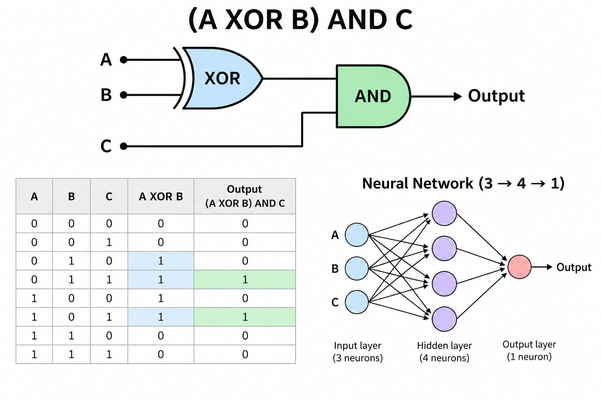
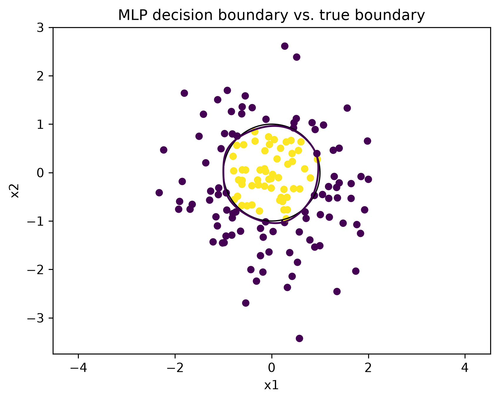

# Neural Networks from Scratch

Small neural networks built from scratch with Python and NumPy to learn the fundamentals of machine learning without PyTorch or TensorFlow.

## xor.py

A simple Multi-Layer Perceptron that learns the XOR problem. The same approach can be adapted to learn other logical gates.

- Architecture: 2 → 4 → 1
- Sigmoid activation
- MSE loss
- Backpropagation and gradient descent
- Reaches 100% accuracy on the four XOR training examples

## logic_network.py

A slightly more complex logical problem where the neural network learns the function:

`(A XOR B) AND C`

The network is not explicitly programmed with XOR and AND gates. Instead, it learns the relationship from all eight possible combinations of A, B and C.

- Architecture: 3 → 4 → 1
- 8 possible input combinations
- Sigmoid activation
- MSE loss
- Backpropagation and gradient descent
- Reaches 100% accuracy on the training examples
- Demonstrates how a neural network can learn a composite logical function

## point_classifier.py

A slightly more realistic classification example using 1,000 randomly generated 2D points.

Points inside a circle with radius 1 belong to class 1, while points outside belong to class 0.

- Architecture: 2 → 8 → 1
- 70% training / 15% validation / 15% test
- Validation accuracy: 98.67%
- Error analysis of misclassified points
- Visualization of the learned decision boundary

## Core Concepts

- Weights, biases and activation functions
- Forward propagation and backpropagation
- Gradient descent
- Training, validation and test sets
- Generalization to unseen data
- Learning simple and composite logical functions
- Decision boundaries and error analysis

## Requirements

Python, NumPy and Matplotlib:

    python -m pip install numpy matplotlib